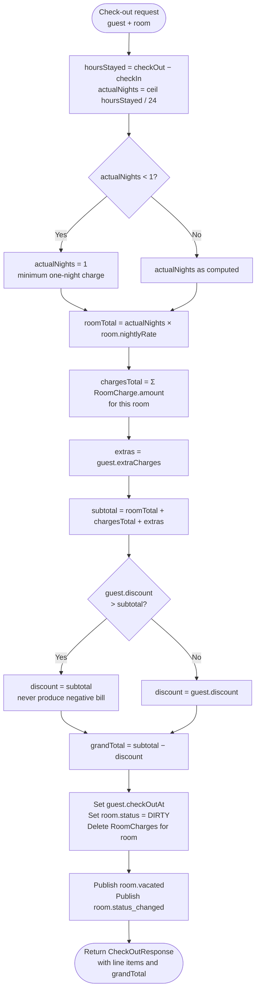

# Billing Algorithm — Flowchart

Runs on every `POST /checkout/{roomNumber}`.
Source: `reception-service/.../service/BillingService.java`.

## Step-by-step description

1. **Compute actual nights** — `Duration.between(checkIn, checkOut).toHours() / 24`, rounded up. This handles early check-out: if a guest booked 3 nights but leaves after 2, only 2 nights are charged.
2. **Floor at one night** — any partial day, or check-in/check-out on the same calendar day, still incurs one night. Hotels do not give free stays.
3. **Room subtotal** — actual nights × the room's nightly rate. Uses `BigDecimal` throughout — never `double` — to avoid floating-point rounding error on currency.
4. **Sum of charges** — every `RoomCharge` linked to this room number, summed. Charges arrived via the `order.created` event from Room Service while the guest was in residence.
5. **Extras** — discretionary additions accumulated on the `Guest` record (minibar, late check-out fee).
6. **Subtotal** — room + charges + extras.
7. **Cap the discount** — a discount that exceeds the subtotal is capped at the subtotal. This prevents producing a negative bill that would imply a refund the system is not equipped to handle.
8. **Grand total** — subtotal − discount.
9. **Persist** — set `checkOutAt` on the guest, set room status to `DIRTY`, delete the room's charges so they do not double-bill a future occupant.
10. **Publish** — `room.vacated` (housekeeping enqueues the room) and `room.status_changed` (dashboard reflects new state).

## Edge cases

| Case | Behaviour |
|------|-----------|
| Early check-out (booked 3, stay 1) | `actualNights = 1`, charged for 1 |
| Same-day check-in and check-out | `actualNights = 1` (floor enforced) |
| Zero room-service charges | `chargesTotal = 0.00`; no error |
| Discount exceeds subtotal | `discount = subtotal`; `grandTotal = 0.00` |
| Room has no open guest | Controller returns `NO_OPEN_GUEST` (HTTP 409) before billing runs |

## Why BigDecimal

The chosen scale is two decimal places with `HALF_UP` rounding — the standard for money in most jurisdictions. Using `double` for this would silently produce values like `260.00000000001` on multiplication; `BigDecimal` keeps the arithmetic exact.
