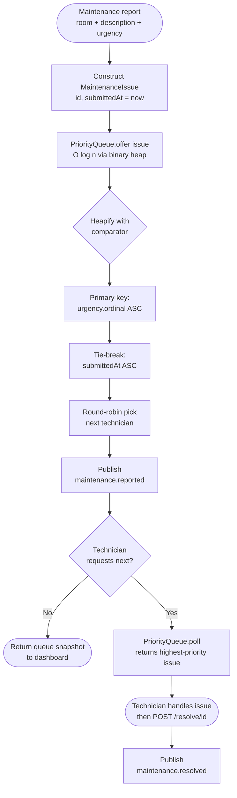

# Maintenance Priority Queue Algorithm — Flowchart

Runs on every `POST /report` (insert) and every technician retrieval (poll).
Source: `maintenance-service/.../service/MaintenancePriorityQueue.java`.

## Step-by-step description

### Insert (POST /report)

1. **Construct** a `MaintenanceIssue` with a fresh id and `submittedAt = Instant.now()`.
2. **Offer** it to `java.util.PriorityQueue<MaintenanceIssue>`. The heap performs `siftUp` in O(log n) to keep heap order.
3. **Comparator** decides ordering:
   - **Primary**: `urgency.ordinal()` ASC. The enum is declared `CRITICAL, HIGH, NORMAL, LOW` so `CRITICAL` has ordinal 0 and floats to the top.
   - **Secondary**: `submittedAt` ASC. If two issues share urgency, the one submitted first comes out first — explicit assignment requirement.
4. **Round-robin** picks the next technician from a `Deque<String>` that rotates: `poll → offer`. This spreads load evenly across technicians.
5. **Publish** `maintenance.reported` so the dashboard shows the new issue immediately.

### Poll (technician retrieval)

1. `PriorityQueue.poll()` removes and returns the highest-priority issue in O(log n).
2. The polled issue is still tracked in `allIssues` (a `Map<Long, MaintenanceIssue>`) so that `/resolve/{id}` can still find it after it has left the queue.

### Resolve (POST /resolve/{id})

1. Look up the issue in `allIssues`.
2. If found and not already resolved, mark `resolved = true` and set `resolvedAt`.
3. Publish `maintenance.resolved`. Reception subscribes and flips the room back from `MAINTENANCE` to `DIRTY` so it can be cleaned and re-let.

## Why a heap

| Approach | Insert | Poll-max | Notes |
|----------|--------|----------|-------|
| Sorted ArrayList | O(n) | O(1) | Insert is too expensive at any real volume |
| Unsorted ArrayList | O(1) | O(n) | Poll is too expensive — happens often |
| **PriorityQueue (binary heap)** | **O(log n)** | **O(log n)** | Balanced; standard library; correctness obvious |
| Sorted Skip List | O(log n) | O(log n) | Same complexity, more code, no library win |

Java's `PriorityQueue` is a binary heap. Both `offer` and `poll` are O(log n), which is the right cost profile for a queue that is written to and read from at similar rates.

## Concurrency

All public methods on `MaintenancePriorityQueue` are `synchronized`. The class is intentionally not thread-safe at the heap level — Java's `PriorityQueue` documents this — so the wrapper provides the locking. The maintenance-reported event arrives on the broker WebSocket thread while technician HTTP requests come in on Tomcat threads; locking the wrapper is the simplest correct answer.
