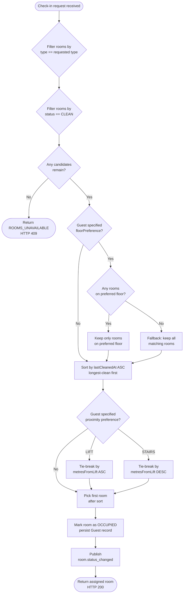

# Room Assignment Algorithm — Flowchart

This is the multi-criteria selection algorithm that runs on every `POST /checkin`.
Source: `reception-service/src/main/java/com/hotelos/reception/service/RoomAssignmentService.java`.

## Step-by-step description

1. **Filter by type** — discard every room whose `type` field does not equal the requested type.
2. **Filter by status** — keep only rooms whose `status` is `CLEAN`. Rooms in `DIRTY`, `CLEANING`, `MAINTENANCE`, or `OCCUPIED` are excluded.
3. **Empty check** — if no candidates remain, return `ROOMS_UNAVAILABLE` (HTTP 409). The system does not crash; it returns a structured error so reception staff can offer the guest an alternative.
4. **Floor preference** — if the guest specified a `floorPreference`, narrow the candidates to that floor. If that subset is empty, **fall back** to all matching rooms — floor is a preference, not a hard constraint.
5. **Longest-clean first** — sort the remaining candidates by `lastCleanedAt` ascending. The room cleaned longest ago is at the head. This enforces fair rotation across the inventory so no room is over- or under-used.
6. **Proximity tie-break** — only if the guest specified `proximityPreference`. For `LIFT`, the tie-break prefers smaller `metresFromLift`. For `STAIRS`, larger `metresFromLift` wins.
7. **Pick** — return the head of the sorted list.
8. **Side effects** — caller marks the room `OCCUPIED`, saves the guest, and publishes `room.status_changed` so the dashboard updates in real time.

## Why this order

- **Hard constraints first (type, status)** — these are non-negotiable. Filtering them out early shrinks the candidate set fast.
- **Floor is preference, not constraint** — the assignment guidance explicitly says fall back when the preferred floor is full. Implementing it as a *bias* rather than a *filter* prevents the algorithm from returning `ROOMS_UNAVAILABLE` when there is actually a perfectly good room one floor up.
- **Longest-clean before proximity** — fair rotation matters more than guest comfort here, because housekeeping resource planning depends on rooms aging at a similar rate. Proximity only breaks ties.

## Alternatives considered and rejected

- **Score-based ranking (weighted sum)** — would have to invent weights for each criterion. Hard to justify and hard to debug ("why was room 203 chosen?"). The cascading filter is more transparent.
- **Random selection among eligible rooms** — fair in expectation but breaks the longest-clean-first rule the assignment requires.
- **Database query with `ORDER BY`** — possible but couples the algorithm to the persistence layer. Keeping selection in Java means the same algorithm could run against any source (in-memory list, REST call, ...).
